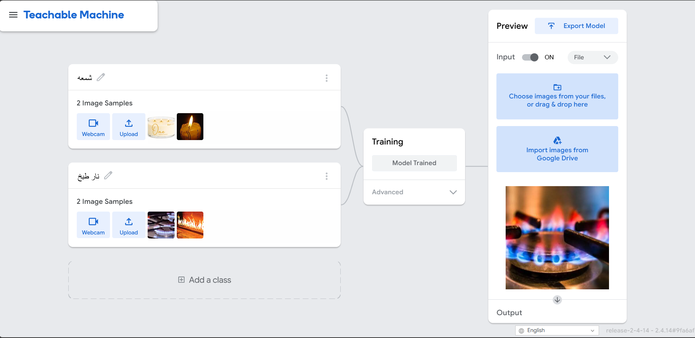

# Cooking Fire vs Candle Classifier

## Overview

This project uses Google Teachable Machine to classify images into two categories:

* Cooking Fire
* Candle Flame

The model was trained using custom image datasets for each class and can predict the type of flame shown in an image.

## Classes

1. Cooking Fire
2. Candle Flame

## Technologies Used

* Google Teachable Machine

  
## Files

- `keras_model.h5` - Trained model file.
- `labels.txt` - Class labels used by the model.
- `Untitled5.ipynb` - Google Colab notebook for testing the model.
- `images (7).jpg` - Example image used for testing.

  
## Project Goal

The goal of this project is to demonstrate image classification using machine learning and distinguish between different types of flames.

## Training Platform

The model was trained using Google Teachable Machine.
